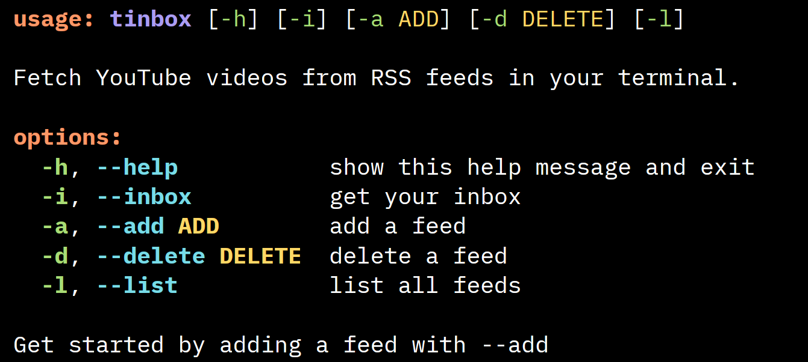

# Tinbox

A YouTube subscriptions inbox in your terminal, using RSS feeds.



## Installation

### Linux

Tinbox is available as an executable for Linux.

1. Download the latest release from [GitHub releases](https://github.com/penthelix/tinbox/releases).
2. Make the executable executable.

```bash
chmod +x tinbox
```

3. Move the executable to a directory in your PATH. Skip this step if you just want to try out the program.

```bash
mv tinbox ~/.local/bin
```

3. Run the executable from the command line.

```bash
tinbox
```

### Others

On Windows and MacOS, you can build from source.

1. Clone this repository.

```bash
git clone https://github.com/penthelix/tinbox.git
```

2. Build the executable using [PyInstaller](https://pyinstaller.org/) or a tool of your choice.

```bash
pyinstaller --onefile src/__main__.py
```

3. Move the executable to a folder in your PATH. This could be `/usr/local/bin` on MacOS.

```bash
mv dist/__main__ /usr/local/bin/tinbox # MacOS
```

On Windows, `C:\Windows` is in your PATH by default, though it is recommended to put the executable in `C:\Program Files\tinbox` and subsequently, add that folder to your PATH. [Here](https://stackoverflow.com/q/44272416) is a guide on that.

4. Run the executable from the command line.

```bash
tinbox
```

## Usage

When running the CLI, you can use the following flags.

1. `-h` or `--help` to see the help message.
2. `-i` or `--inbox` to get your inbox.
3. `-a` or `--add` to add a YouTube channel's RSS feed.
4. `-d` or `--delete` to delete a YouTube channel's RSS feed.
5. `-l` or `--list` to list all feeds that are being tracked.

If no flag is passed, the program behaves as if `-i` or `--inbox` was passed.

## Project Structure

```
tinbox
|-- src
|   |-- tinbox
|       |-- __init__.py
|       |-- __main__.py # the CLI
|       |-- config.py # handles your config
|       `-- fetch.py # handles fetching RSS feeds
|-- tests
|   |-- __init__.py
|   `-- test_fetch.py
|-- .gitignore
|-- LICENSE
|-- pyproject.toml
|-- README.md
`-- uv.lock
```

## Dev Setup

1. Check if you have uv installed. If not, install [uv](https://docs.astral.sh/uv/getting-started/installation/).

```bash
uv --version
```

2. Create virtual environment and install dependencies.

```bash
uv sync
```

3. Run the CLI.

```bash
tinbox
```

## Compatibility

Tinbox has been tested on the following operating systems.

1. Debian 13

## Troubleshooting

If the executable does not run on Linux, ensure that it has execution permissions.

```bash
chmod +x tinbox
```
